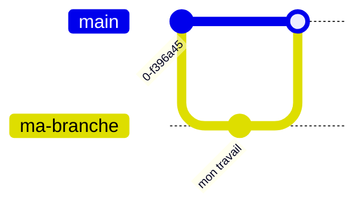

# Cours 01 — Les Pull Requests

> **Niveau** : débutant · **Durée** : 20 min · **Pré-requis** : `git add`, `git commit`, `git push`

---

## 1. Les branches

Une **branche** est une copie parallèle du code, où l'on travaille **sans toucher à l'original**.

**Analogie — le manuscrit.** Tu écris un livre avec un éditeur. Tu ne ratures pas le manuscrit officiel : tu **photocopies** le chapitre, tu corriges la photocopie, puis tu la déposes sur son bureau. Il relit, puis reporte les corrections sur l'original.

- Le manuscrit officiel = la branche **`main`**, qui doit rester propre et fonctionnelle
- La photocopie = **ta branche**
- Le dépôt sur le bureau = **la Pull Request**

| Sans branche | Avec branche |
|---|---|
| Les essais partent direct en production | Les essais restent isolés |
| Pas de relecture avant intégration | Relecture organisée |
| Une erreur casse le travail de tous | L'erreur reste confinée |

---

## 2. La Pull Request

Une **Pull Request** (« demande de tirage », abrégée **PR**) est une **proposition de modification** :

> *« Voici ce que je propose d'intégrer dans `main`. Qu'en pensez-vous ? »*

Ce n'est **pas** une commande Git. C'est une fonctionnalité de GitHub construite par-dessus Git, qui ajoute la discussion, la relecture et les vérifications automatiques.

### ⚠️ Le point à retenir absolument

**Une PR compare toujours DEUX branches.** Elle ne « publie » pas du code : elle affiche une **différence**.

```
  branche source  ──────►  branche cible
  (ma-branche)              (main)
  ce que je propose       ce qui existe
```

> ❌ Impossible d'ouvrir une PR de `main` vers `main` — comparer un document avec lui-même ne montre aucune différence. GitHub refuse.
>
> **C'est pour cette raison que l'étape 1 est toujours « créer une branche ».**

### Ce qu'on trouve dans une PR

- **Conversation** — discuter, poser des questions
- **Commits** — l'historique des modifications proposées
- **Files changed** — le détail ligne par ligne (rouge = supprimé, vert = ajouté)
- **Checks** — les workflows automatiques déclenchés par l'ouverture de la PR

---

## 3. Le cycle complet



### Étape 1 — Créer une branche et s'y placer

```bash
git checkout -b ma-branche
```

- `checkout` = « va sur cette branche »
- `-b` = « …en la créant au passage »

Cette commande crée la photocopie **et** t'y installe. Vérifie avec `git branch --show-current`.

### Étape 2 — Modifier, puis enregistrer

```bash
git add .
git commit -m "feat: ma modification"
```

**Analogie du colis** : `git add` met les fichiers dans le carton, `git commit` le ferme et colle l'étiquette. À ce stade, **tout est encore sur ton ordinateur** — GitHub ne sait rien.

### Étape 3 — Envoyer la branche

```bash
git push -u origin ma-branche
```

- `origin` = le surnom du dépôt distant sur GitHub
- `-u` = crée le lien permanent local ↔ distant (les prochains `git push` suffiront, sans arguments)

⚠️ **Pousser une branche ne crée aucune PR.** Ce sont deux actions distinctes.

### Étape 4 — Ouvrir la Pull Request

```bash
gh pr create --fill --base main
```

- `--fill` = remplit titre et description à partir du message de commit
- `--base main` = la branche **cible**, celle qu'on propose de modifier

**Par le site web** : après l'étape 3, une bannière jaune « **Compare & pull request** » apparaît sur la page du dépôt. Le résultat est identique — `gh` fait la même chose sans quitter le terminal.

### Étape 5 — Fusionner et nettoyer

```bash
gh pr merge --squash --delete-branch
git checkout main
git pull
```

| Commande | Rôle |
|---|---|
| `--squash` | Regroupe tous les commits en **un seul** dans `main` → historique lisible |
| `--delete-branch` | Supprime la branche devenue inutile |
| `git pull` | Récupère le résultat de la fusion sur ton ordinateur |

⚠️ **N'oublie pas `git pull`.** Après un merge, ton `main` local est en retard. Sans lui, tu repartirais d'une base périmée et créerais des conflits inutiles.

---

## 4. Les pièges classiques

| Piège | Ce qu'il faut savoir |
|---|---|
| **PR de `main` vers `main`** | Refusée : aucune différence à afficher. Crée une branche d'abord. |
| **PR vide** | Il faut au moins un commit de différence. |
| **`git push` ≠ PR** | Pousser envoie du code ; ouvrir une PR crée la proposition. |
| **`>` au lieu de `>>`** | Un seul chevron **écrase** tout le fichier. Deux ajoutent à la fin. |
| **Oublier `git pull` après le merge** | `main` local périmé → conflits à la prochaine branche. |
| **Pastille orange « Queued »** | Ce n'est **pas** une erreur : le workflow attend une machine libre. |
| **Travailler directement sur `main`** | On perd tout l'intérêt : relecture, isolation, vérifications. |

---

## 5. Bonnes pratiques

- **Une branche = un sujet.** Ne mélange pas deux chantiers dans la même PR.
- **Des PR courtes.** Une PR de 20 lignes est relue sérieusement ; une de 2 000 est approuvée sans être lue.
- **Nomme clairement tes branches** : `fix-login`, `feat-export-pdf` — pas `test2` ni `truc`.
- **Décris le *pourquoi* dans la PR**, pas le *quoi*. Le code montre déjà ce qui change.
- **Attends que les checks soient verts** avant de merger.
- **`main` reste propre** : on y intègre du travail relu, jamais des essais.

---

## Glossaire

| Terme | Définition |
|---|---|
| **Branche** | Copie parallèle du code, isolée de l'original |
| **`main`** | La branche principale, version de référence du projet |
| **Commit** | Enregistrement daté et étiqueté d'un ensemble de modifications |
| **Push / Pull** | Envoyer ses commits sur GitHub / récupérer ceux de GitHub |
| **Pull Request** | Proposition de fusionner une branche dans une autre |
| **Merge** | Intégrer effectivement les modifications d'une PR |
| **`origin`** | Surnom standard du dépôt distant sur GitHub |
| **`gh`** | Outil officiel GitHub en ligne de commande |

---

## Antisèche

```bash
# Cycle complet
git checkout -b ma-branche                  # 1. créer la branche
git add . && git commit -m "feat: ..."      # 2. enregistrer
git push -u origin ma-branche               # 3. envoyer
gh pr create --fill --base main             # 4. ouvrir la PR
gh pr merge --squash --delete-branch        # 5. fusionner
git checkout main && git pull               #    se remettre à jour

# Diagnostic
git branch --show-current    # sur quelle branche suis-je ?
git status                   # qu'ai-je modifié ?
gh pr list                   # les PR ouvertes
gh pr status                 # l'état de ma PR courante
```

---

## Les 3 idées à retenir

1. **Une PR compare deux branches** → d'où l'obligation d'en créer une avant.
2. **Pousser une branche ne crée pas de PR** → ce sont deux actions distinctes.
3. **`main` reste propre** → on y intègre du travail relu, jamais des essais.
